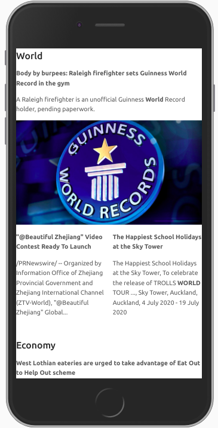

# This repository show an example of the a PWA to read news.

Live code to [Digital Innovation One](https://digitalinnovation.one/)

Organized at **07/21/2020 at 8 p.m (Brazil)**

### Link to access the application: [PWA NEWS DIO](https://pwa-news-dio.netlify.app/)

### API used in this POC: [API](https://github.com/Tautorn/pwa-news-api)

### Slides used in this lecture:  [Slides PWA News](./docs/pwa.pdf)

### Important links:

- PWA created to monitoring Covid19 around the world
[Covid19](https://covid19pwa.netlify.app/)

- Who's use PWA [https://www.pwastats.com/](https://www.pwastats.com/)

- Tool to turn your website in a PWA. Quickly and easily
[https://www.pwabuilder.com/](https://www.pwabuilder.com/)

- Site to create your PWA manifest
[https://app-manifest.firebaseapp.com/](https://app-manifest.firebaseapp.com/)

### References

* https://divante.com/pwabook/chapter/03-pwas-in-the-mobile-first-world.html#what-is-the-mobile-first-approach

* https://divante.com/pwabook/chapter/02-the-history-of-pwas.html#the-history-of-progressive-web-apps

* https://infrequently.org/2015/06/progressive-apps-escaping-tabs-without-losing-our-soul/

* https://pt.wikipedia.org/wiki/Progressive_web_app

* https://developers.google.com/web/fundamentals/primers/service-workers?hl=pt-br

* https://developer.mozilla.org/pt-BR/docs/Web/API/Service_Worker_API/Using_Service_Workers

* https://www.netlify.com/blog/2017/10/31/service-workers-explained/

* https://codelabs.developers.google.com/codelabs/your-first-pwapp/#0

* https://medium.com/@vipulnema2610/understanding-service-worker-life-cycle-b6580aa4eb50